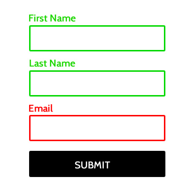
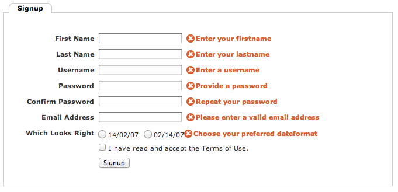

# Accessible Development
# For All!

---

## Hello! My name is Joni.

* Sr. Javascript front-end dev @ Georgetown
* Pseudo-avid Tweeter: [@jonihalabi](https://twitter.com/jonihalabi)
* More-than-occasional runner
* Baker of a mean oatmeal chocolate chip cookie

---

## P.S. All of these slides are online

http://thatdevgirl.com/talks/accessibility/

---

## Accessible development is just as important as responsive development.

Note:
Responsive dev caters to users of different screen sizes.

Accessible dev caters to users of different browsing tools.

Our responsibility (and goal) as developers is to make sites that everyone can use.

--

### This talk is really about
## ~~Accessible development~~
## Development!

Note:
We have been developing the wrong way if our code is not accessible.

Accessible development practices should be baked into our regular development practices.

--

``

--

``


--

### What do we want?
## *Accessible websites!*
### When do we want it?
## *Right from the start!*

Note:
Accessibility is a process, not a project.

Requirements -> UX -> design -> development -> testing -> release

Story time! Talk about the accessibility retro-fit at GU.

--

We have our design and UX direction from the team.

We know what experience we want all users to have.

How do we start coding?

--

## K.I.S.S.

[For example...](http://thatdevgirl.com/talks/accessibility/examples/kiss)

Note:
Keep your HTML code to the basics.

--

```
<!DOCTYPE html>
<html>

<head>
  <title>This is an accessible website</title>
</head>

<body>
  <main>
    <h1>This is an accessible website!</h1>
  </main>
</body>

</html>
```

--

* Clean markup
* Use HTML5 tags
* Be **SEMANTIC**
* Use as few ARIA and role attributes as possible.

Note:
Good code = accessible code

ARIA and role attributes are there to help, not to use exclusively.

---

## Landmarks are your (and your users') friends.

Landmarks allow users to navigate through the major sections of a site.

--


--


--

| HTML 5 Tag | Role |
| ------ | ------ |
| `<header>` | banner |
| `<nav>` | navigation |
| `<main>` | main |
| `<aside>` | complementary |
| `<section>` | region |
| `<article>` | article |
| `<footer>` | contentinfo |
| `<form>` | form |

--

## Landmarks and Labels

A landmark isn't very useful if you can't tell one from another.

Note:
All duplicate landmark roles need labels!

--

## This is OK:

```
<header>
  <h1>My site header!</h1>
</header>

<section>
  <p>All the things about my site</p>
</section>
```

--

## This is *not* OK:

```
<section>
  <p>All the things about my site</p>
</section>

<section>
  <p>More things about my site</p>
</section>
```

--

## The fix!

```
<section aria-label="All the things">
  <p>All the things about my site</p>
</section>

<section aria-label="Even more things!">
  <p>More things about my site</p>
</section>
```

Note:
aria-labelledby: Works in JAWS, but for some reason not in VoiceOver.

---

## Don't forget about the little details

Note:
There are lots of large-scale development practices that you need to keep in mind, but don't forget about the little "gotchas" too.

---

## Phone numbers are a huge pain

--

## First and foremost, use a `tel:` link

`<a href="tel:7035551212">(703) 555-1212</a>`

--

## (703) 555-1212

Note:
Read as "seven hundred three (pause) five hundred fifty-five minus one thousand two hundred twelve" in JAWS

Read as digits in VoiceOver

--

## 703.555.1212

Note:
Read as "seven hundred three (pause) five hundred fifty-five (pause) one thousand two hundred twelve" in JAWS

Read as "seven zero three dot five five five dot one two one two" in VoiceOver

--

## A workaround

`<span>7</span> <span>0</span> <span>3</span> <span>5</span> <span>5</span> <span>5</span> - <span>1</span> <span>2</span> <span>1</span> <span>2</span>`

Note:
OMG no.

--

## A better solution

`<a href="tel:7035551212" aria-label="7 0 3. 5 5 5. 1 2 1 2.">(703) 555-1212</a>`

---

## Link `title` attribute does not do what you think it does

Screen readers are inconsistent with the `title`.

Note:
Even if there is an image, screen readers will read the image's alt text, still not the link's title text.

Screen readers only read `title` text if there is **no** link text.

---

## Semantic differences between `<b>` and `<strong>`

`<b>` is for stylistically offset text; i.e. keywords or anything typographically bold.

`<strong>` is for text with strong importance

---

## Semantic differences between `<i>` and `<em>`

`<i>` is for text in an alternative voice; i.e. foreign words or technical terms.

`<em>` is for text that has stress emphasis; i.e. something you would pronounce differently.

---

## Accessible forms

* Logical structure
* Navigable with the keyboard
* Correct and useful error notifications

--

## Labels

```
<label>
  <input placeholder="Your Name">
  Your Name
</label>
```

or

```
<label for="yourname">Your Name</label>
<input id="yourname" placeholder="Your Name">
```

--



--



---

## Thank you!

* Slides: http://thatdevgirl.com/talks/accessibility/
* Twitter: [@jonihalabi](https://twitter.com/jonihalabi)

---


---

# Questions?

---

## Accessibility guideline documentation

* [W3C](www.w3c.com)
* [Section 508](www.section508.gov)
* [Siteimprove](www.siteimprove.com)

---

## References

* [Accessibility and phone number formatting](http://www.jhalabi.com/blog/accessibility-phone-number-formatting/)
* [I thought title text improved accessibility](https://silktide.com/i-thought-title-text-improved-accessibility-i-was-wrong/)
* [Semantic differences between &lt;b&gt;, &lt;strong&gt;, &lt;i&gt;, and &lt;em&gt;](http://html5doctor.com/i-b-em-strong-element/)
* [Testing with a screen reader](http://www.jhalabi.com/blog/accessibility-screen-reader/)
