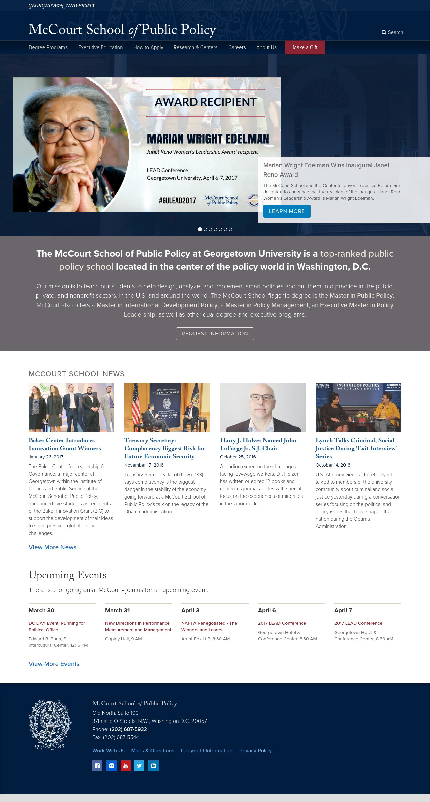
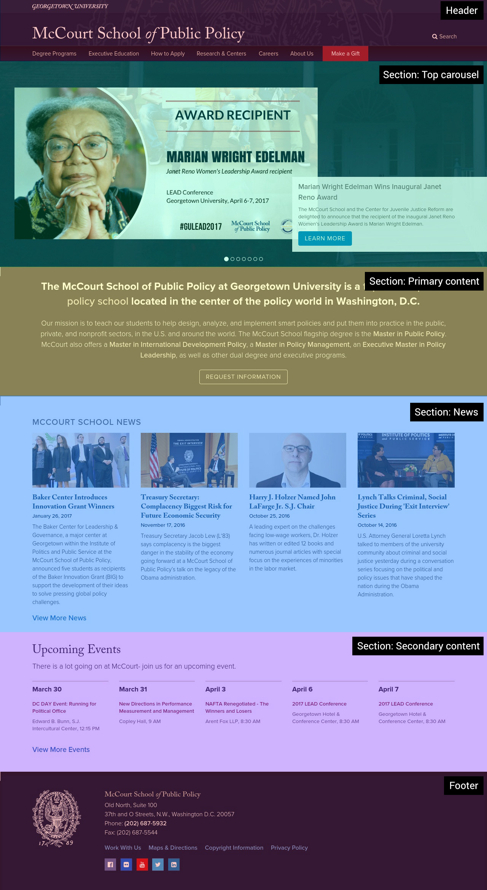

# Accessible Development
# For All!

---

## Hello! My name is Joni.

* Sr. Javascript front-end dev @ Georgetown
* Pseudo-avid Tweeter: [@jonihalabi](https://twitter.com/jonihalabi)
* More-than-occasional runner
* Baker of a mean oatmeal chocolate chip cookie

--

## P.S. All of these slides are online

http://thatdevgirl.com/talks/accessibility/

---

## Accessible development is just as important as responsive development.

Note:
Responsive dev caters to users of different screen sizes.
Accessible dev caters to users of different browsing tools.
Our responsibility (and goal) as developers is to make sites that everyone can use.

---

## How do we start?

--

## K.I.S.S.

[For example...](http://thatdevgirl.com/talks/accessibility/examples/kiss)

--

## What do we want?
## *Accessible websites!*
## When do we want it?
## *Right from the start!*

Note:
Story time! Talk about the accessibility retro-fit at GU.

---

## Good code = accessible code

--

* Clean markup
* Use HTML5 tags
* Use as few ARIA and role attributes as possible.

Note:
ARIA and role attributes are there to help, not to use exclusively.

--

## Landmarks are your (and your users') friends.

Landmarks allow users to navigate through the major sections of a site.

--

--

---

## Thank you!

* Slides: http://thatdevgirl.com/talks/accessibility/
* Twitter: [@jonihalabi](https://twitter.com/jonihalabi)
